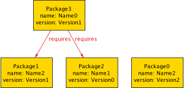

## Introduction

It is well known that Python's pip's legacy dependency resolution algorithm allows users to uninstall previously installed packages with different versions. This can break previously installed packages, or even worse be relied upon in order for them to work. The new version of pip has a new dependency resolver to prevent this from happening.

In this article we iterately design a package manager using formal methods and discover that pip's approach was doomed. We then use the model to see options for resolving this.

You can follow along by [downloading Alloy](https://alloytools.org/download.html) if you'd
like.



## Prior art, references, and other resources

[Formal Software Design with Alloy 6](https://haslab.github.io/formal-software-design/) is
a work-in-progress book documenting the most recent release of Alloy, [Alloy
6](https://alloytools.org/alloy6.html). I learned a lot following the guide, and this is a
great starting point for learning about Alloy.

I knew that I wanted to model a simplified version of pip's legacy dependency resolution
algorithm and started reading [Formally Specifying a Package
Manager](https://www.hillelwayne.com/post/nix/). This article inspired me to get started.

## What are packages?

Let's assume there's a local omnipotent package manager that knows about all possible
packages. Alloy refers to types as **signatures**; think of a signature as a class, and an
**atom** as an instance of a class. We can express this as:

```alloy
sig Package {}
```

In Alloy you're encouraged to start validating a design very early on even if the
specification is incomplete. That way you spot design problems or specification errors as
early as possible. So let's create an example and run it:

```alloy
sig Package {}

run example {}
```

_(see [pm1.als](https://gist.github.com/asimihsan/b77d5f8da77dbde6ed394760a9d0b598#file-pm2-als))_

One of the matching examples is:


There a class (signature) `Package`, and in this example two objects (atoms) `Package0`
and `Package1`. So far so good.

The simplest way of representing packages would be to add three new fields:

- **name**, e.g. "scipy" or "face-detector-lib".
- **version**, e.g. "1.0" or "0.9".
- **requires**, a set of zero or more other packages that this package depends on.

```alloy
sig Package {
    name : one Name,
    version : one Version,
    requires : set Package,
}

sig Name {}

sig Version {}

run example {}
```

_(see [pm2.als](https://gist.github.com/asimihsan/b77d5f8da77dbde6ed394760a9d0b598#file-pm1-als))_

_(I change the Alloy theme to set "Show as arcs" to off for name and version)_


Hmm, that's strange, it doesn't make sense for a package at a version to depend on itself
at a different version. I think this holds transitively, not just for the immediate
dependency. And on further thought, this doesn't just hold for the starting package but
any package in the dependency graph.

I'm going to add this as a **fact**, a predicate that is always true that reduces the
solution space, and isn't something we're checking or asserting.

```alloy
sig Package {
    name : one Name,
    version : one Version,
    requires : set Package,
}

sig Name {}

sig Version {}

fact "only one package version in dependency graph for package" {
    all p1 : Package, disj p2, p3 : p1.*requires | p2.name != p3.name
}

run example {}
```

_(see [pm3.als](https://gist.github.com/asimihsan/b77d5f8da77dbde6ed394760a9d0b598#file-pm1-als))_

Let's pick another example:


Oh, we also don't want the package itself appearing in its dependency graph. Let's also
make the examples more interesting:

```alloy
<snip>

fact "package doesn't require itself at any version" {
    all p : Package | p.name not in (p.requires).name
}

run example {
    // At least 3 Packages
    #(Package.name) >= 3

    // At least two requirements
    #(Package.requires) >= 2
} for 5
```

_(see [pm4.als](https://gist.github.com/asimihsan/b77d5f8da77dbde6ed394760a9d0b598#file-pm4-als))_



Now we're cooking with gas! If we install Package3 and then Package0, the pip legacy
dependency resolution algorithm would remove the old version of Name2 and break Package3.

So we're in good place with the signatures and basic facts, but how do I reproduce pip
deleting an old dependency?

## Package installation over time

[Alloy 6](https://alloytools.org/alloy6.html) is a new major version of Alloy that lets it
analyze _behavioral_ models explicitly, i.e. models that change over time. Before we jump
there let's first model the idea of an **installed package**.

By using `sig InstalledPackage in Package {}` we're saying that `InstalledPackage` is
non-disjoint a subset of `Package`. This is the easiest way I found to model the
installation state of a package.

```alloy
sig InstalledPackage in Package {}
```

_(see [pm5.als](https://gist.github.com/asimihsan/b77d5f8da77dbde6ed394760a9d0b598#file-pm5-als))_


So this is how to model installed packages, but how do we vary this state over time? This
will take a few steps.

First, we tell Alloy that the set of installed packages varies over time by prepending the
signature with `var`:

```alloy
var sig InstalledPackage in Package {}
```

Secondly, set an initial condition that there are no installed packages:

```alloy
fact {
    no InstalledPackage
}
```

Next let's create two events. The first installs a package, and we want to match pip's
legacy algorithm. An event is a **predicate** split up into three parts:

1. **Guard**, what must be true in order to execute
2. **Effects**, what temporal variables to change
3. **Frame conditions**, what temporal variables to keep the same.

```
pred install[p : Package] {
    // guard
    p not in InstalledPackage

    // effects

    // This enforces only one package with same name installed at any given time
    InstalledPackage' = p.*requires + {p2 : InstalledPackage | p2.name not in (p.*requires).name}

    // no frame conditions
}
```

Notice how we do not guard against removing existing packages, and the effect enforces
only one package version installed at a time.

We need a second `stutter` event that does nothing. This allows Alloy to always explore
infinitely long traces, which is a condition of using `var`.

```alloy
pred stutter {
    // no guard
    // no effects
    InstalledPackage' = InstalledPackage	// frame condition
}
```

Now we tie together the two events and set up a fact that one or the other are always
running:

```alloy
fact {
    always (
        stutter or
        one p : Package - InstalledPackage | install[p]
    )
}
```

Put it all together and get an example.

_(see [pm6.als](https://gist.github.com/asimihsan/b77d5f8da77dbde6ed394760a9d0b598#file-pm6-als))_


The left boxes are time 0 and the right are time 1. We know this means we're installing Package2, and hence Package0, but it's a bit hard to interpret this. We use a trick to make the events appear explicitly by adding:

```alloy
enum Event { Stutter, Install }

fun install_happens : set Event -> Package {
	{ e : Install, p: Package | install[p] }
}

fun stutter_happens : set Event {
	{ e : Stutter | stutter }
}
```

_(see [pm7.als](https://gist.github.com/asimihsan/b77d5f8da77dbde6ed394760a9d0b598#file-pm7-als))_


Finally let's actually check that installed packages always have their dependencies:

```alloy
assert PackagesHaveDependencies {
	always (all p : InstalledPackage | p.*requires in InstalledPackage)
}

check PackagesHaveDependencies for 3
```

_(see [pm8.als](https://gist.github.com/asimihsan/b77d5f8da77dbde6ed394760a9d0b598#file-pm8-als))_

And they don't:


Package0 is installed and requires Package2 (Name0 at Version1). Then we install Name0 at Version0. Whoops, we removed Name0 at Version1 and broke Package2.

How do we fix this? There are two options that the model are telling us:

1. The `install` predicate lacks a guard to prevent it from uninstalling already installed packages. We could add such a predicate. This is how pip's new resolver logic works.
2. The `install` predicate effect's could somehow support packages with the same name and multiple versions.

## Future work and areas for improvement

TODO