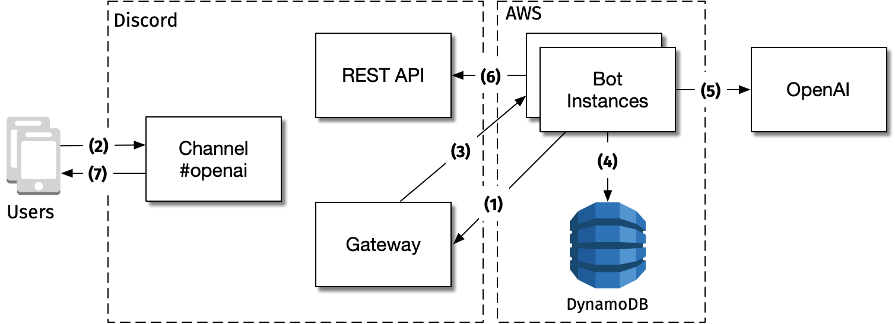



## Problem statement

Creating a chatbot that can have conversations with multiple users can be
challenging. OpenAI's language models can be used to create such a chatbot, but
hosting it on a web application is not ideal as it would require a lot of extra
work. Using an existing chat platform makes it much simpler to access the
chatbot from any device. Additionally, the application must be secure to protect
user data, highly available to ensure a good user experience, and
cost-effective to prevent costly overhead.

For the initial prototype, I decided to explore a long-term design with a focus
on cost-effectiveness, rather than high availability verifying scalability using
load testing.

## System overview

1. Bot instances are running on multiple EC2 spot instances. Each one sets up a
   WebSocket connection to the Discord Gateway.
2. Users connect to Discord using their preferred client. When they chat in
   channels, the messages are sent to the Discord server.
3. The Discord server forwards the messages to all of the bot instances over
   WebSocket.
4. For a given message, all bot instances try to acquire a lease on the message
   in DynamoDB. The instance that acquires the lease is the one that responds to
   the message. The others ignore the message.
5. The bot instance that acquired the lease sends the message to OpenAI to get a
   response.
6. The bot instance sends the response to the Discord REST API.
7. The Discord server forwards the response to the Discord clients of all the
   users in the channel.

Using Discord as a chat platform provides an easy way to create a bot that can
be accessed from any device. Moreover, OpenAI makes it easy to create a chatbot
that can have a natural conversation with users. By combining these two tools,
we can create a chatbot that can be accessed from any device and can have
conversations with multiple users.

Although any computer can run the bot, using AWS provides several benefits,
which are discussed in the following sections.

## Key challenges

My current prototype implementation is available on GitHub at
[openai-discord-bot](https://github.com/asimihsan/openai-discord-bot). To reach
this stage, I had to overcome several challenges. The following sections discuss
the challenges I faced and how I solved them.

### Optimizing for cost whilst maintaining availability

The bot must be highly available to ensure a good user experience. To ensure
availability, we must always run at least two instances of the bot; as the
saying goes, "two is one, one is none". However, running two instances increases
the cost of hosting the bot. To reduce the cost, we can use EC2 spot instances.
Spot instances are available at a discount compared to on-demand instances;
t4g.nano instances cost only $0.0016 per hour ($1.2 per month) in us-west-2.
However, spot instances can be terminated at any time, so we must ensure that
the bot is always available.

EC2 spot instance interruptions are normally announced 2 minutes in advance. By
configuring an AWS Auto Scaling Group (ASG) to launch the spot instances, ASG
will automatically launch a new instance when the current instance is about to
be terminated. Moreover, we configure the ASG with multiple instance types and
multiple availability zones. This reduces the likelihood of there not being any
spot instances available. For infrastructure details, see
[infra/compute.tf](https://github.com/asimihsan/openai-discord-bot/blob/main/infra/compute.tf).

### Handling faults

When a new message arrives in a channel, all of the bot instances try to acquire
a lease on the message in DynamoDB. The instance that acquires the lease is the
one that responds to the message. The others ignore the message. This reduces
the number of unneeded calls to OpenAI, which is expensive and slow. I
duplicated the algorithms used in the [AWS DynamoDB Lock
Client](https://github.com/awslabs/amazon-dynamodb-lock-client) in Go; see
[dynamodb.go](https://github.com/asimihsan/openai-discord-bot/blob/main/src/aws/dynamodb.go).

However, several edge cases must be handled. For example, if the bot instance
that acquired the lease is terminated, the lease will eventually expire and
another instance will acquire the lease. This does mean that the instances need
to be aware of expired leases and acquire them. This is done by using a Global
Secondary Index (GSI) on the DynamoDB Lock table. The GSI is used to query for
expired leases. The bot instances periodically query the GSI to find expired
leases and acquire them. To reduce the risk of [GSI
backpressure](https://aws.amazon.com/premiumsupport/knowledge-center/dynamodb-gsi-throttling-table/)
the GSI is sharded.

Another edge case is if the bot instance that acquired the lease pauses for a
long time, for example, due to garbage collection or a long-running Discord
call. This may cause another instance to steal the lease and more than one
message being sent to both OpenAI and the Discord thread. For now I accept this
risk as at-least-once delivery is acceptable for this use case.

### Connecting a bot to Discord

Using Discord as a chat platform provides an easy way to create a bot that can
be accessed from any device. The Discord Gateway offers a WebSocket interface
that allows bots to receive events without the need for polling the Discord REST
API.

This was remarkably difficult to implement, even with the help of
[discordgo](https://github.com/bwmarrin/discordgo). I found that the lack of
documentation and the lack of examples made it difficult to get started. With
some trial and error, I was able to get it working. My hacky implementation is
available in
[discord.go](https://github.com/asimihsan/openai-discord-bot/blob/main/src/discord/discord.go).

### Creating a chatbot with OpenAI

OpenAI language models enable the bot to have a natural conversation with users.
By providing a prompt that contains all of the past messages in the
conversation, the bot can provide useful information in response to the user.

This was the easiest part of the project. The prompt used is in
[initial_prompt_01.txt](https://github.com/asimihsan/openai-discord-bot/blob/main/src/openai/initial_prompt_01.txt).

## Future work

- Not all of the fault handling is implemented yet.
- I will need to add some formal modeling to verify that the lease management
   algorithm is correct.

## Conclusion

I have created a chatbot that can be accessed from any device and can have a
natural conversation with multiple users. The bot uses OpenAI language models
to generate responses and Discord as a chat platform. The bot is hosted on AWS
using EC2 spot instances and DynamoDB. The bot is highly available and
cost-effective. Implementing the prototype gave me a good understanding of how
to use OpenAI and Discord. I will continue to work on this project to improve
the fault handling and add more features.
