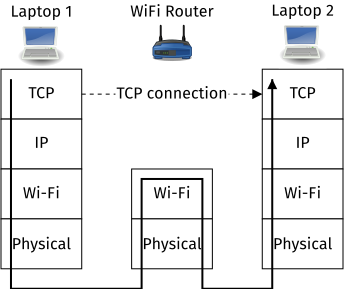
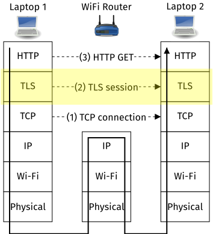
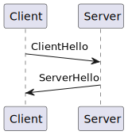



## Introduction

Before going into the specifics of the Transport Layer Session (TLS) protocol we
need to be clear about what problems it solves.

When two computers talk over a network using an in-order reliable byte stream
protocol like the Transmission Control Protocol (TCP), TCP forms a logical
end-to-end connection, yet the data may flow through many other routers and
devices. For example, consider two laptops talking to each other via a wifi
router on a local network, where the first laptop wants to call an HTTP method
on the second laptop:

When laptop 1 talks to laptop 2, the actual data flows down a network stack and
is sent through the air as electromagnetic waves to the WiFi router. The WiFi
router interprets the WiFi data and forwards this again as electromagnetic waves
to laptop 2. The data travels up laptop 2's network stack, which interprets it
as TCP data. However, it is simpler and still accurate to think of a "logical"
TCP connection existing directly between laptop 1 and laptop 2. Once laptop
establishes a TCP connection it can call an HTTP method on laptop 2.

In practice, when two computers talk over the Internet there are many more
devices involved in the network path, yet still a single end-to-end logical TCP
connection. This presents a problem from a security point of view. How do you
keep the TCP connection "secure" whilst also flinging the packets across tens of
devices you don't trust?

## Threat model

Concretely, let's focus on defining a secure connection from laptop 1 to
laptop 2 as:

1. **Confidentiality - now**: only laptop 2 knows what data laptop 1 sends, the
   WiFi router in this example cannot see the data.
2. **Confidentiality - forward secrecy**: Even if an adversary records all data
   and cracks some "key" that secures the data, on cracking the key the adversary
   cannot decrypt data sent in the past.
3. **Integrity**: Laptop 2 is confident that data is not modified accidentally
   or deliberately in transit.
4. **Authentication**: Laptop 2 knows that data it receives is from laptop 1,
   and laptop 1 knows that it is talking to laptop 2.

Transport Layer Security (TLS) solves the problem of providing these four
security properties. It does so by adding yet another logical layer on top of
TCP. Once laptop 1 establishes a TCP connection to laptop 2, it can set up a TLS
session:

Notice how TLS is the peanut butter and jelly in the network stack sandwich.
Once laptop 1 establishes a TCP connection it will set up a TLS session. Once
laptop 1 establishes a TLS session it again calls an HTTP method. Also notice
how the squiggly arrow's path does not change, we are still traversing tens of
untrusted devices but establishing trust nonetheless.

On top of these desired security properties, we're worried about adversaries
that can monitor all traffic, tries to pretend the client or the server, and can
replay recorded traffic in the future.

## TLS 1.3, asymmetric key-pairs vs. PSKs

TLS is immense and complex, let alone TLS 1.3 and the changes from TLS 1.2 to
1.3 [^1]. At a basic level there are three parts to setting up a TLS session:

1. **Handshake Protocol**, a) establishing a shared key and b) authentication
   of the client / server and the key.
2. **Record Protocol**, how the client and server exchange messages securely.

In this article I'm curious about the handshake protocol, how asymmetric
cryptography is typically used, and why and how Preshared Keys (PSKs) are an
optipn.

## TLS in action with OpenSSL CLI

- `openssl` command line easy to use, just look at the terminal!
- Also great way of verifying interoperability.
- Show some key sections, what means what

## End-to-end encryption in action with stunnel

- stunnel, host to host, what problem it solves

## End-to-end encryption in action with your own code

- Uses Rust but most of the code is actual OpenSSL over FFI
- Show Wireshark, decryption mode
- Show effect of OpenSSL flags

## Open issues and areas for investigation

## References

[^1]:
    [Rescorla, Eric. The Transport Layer Security (TLS) Protocol Version 1.3.
    No. RFC 8446. 2018.](https://www.rfc-editor.org/rfc/rfc8446.html)

## Appendix
